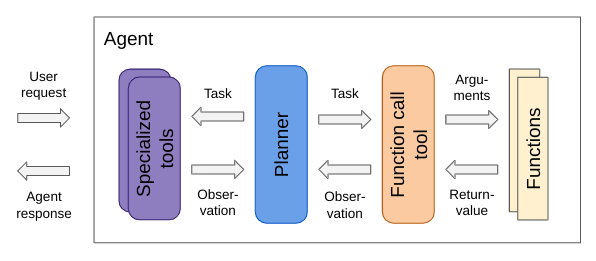

## Key features

- ReAct-style LLM agents with planning separated from function calling
- Planner fine-tuning on synthetic trajectories from an agent simulation
- Generalization of planning behavior from simulation to real environments
- Schema-guided generation for reliable communication between LLM modules

You can read more in the following [overview](#overview) and in these articles:

- [Planner fine-tuning on synthetic agent trajectories](https://krasserm.github.io/2024/05/31/planner-fine-tuning/)
- [Separation of planning concerns in open LLM agents](https://krasserm.github.io/2024/03/06/modular-agent/)
- [Schema-guided generation with open LLMs](https://krasserm.github.io/2023/12/18/llm-json-mode/)
- [Schema-guided generation in LangChain agents](https://krasserm.github.io/2023/12/10/grammar-based-agents/)

This project also provides fully-functional RAG-based [search tools](gba/tools/search/):

- Wikipedia search based on a quantized local search index
- Internet search without an API key thanks to [SearXNG](https://github.com/searxng/searxng)
- Summarization of retrieved documents with Llama-3-8B-Instruct

## Table of contents

- [Overview](#overview)
  - [Environments](#environments)
  - [Planners](#planners)
- [Getting started](#getting-started)
  - [Setup](#setup)
  - [Examples](#examples)
- [Resources](#resources)

## Overview

[ReAct](https://arxiv.org/abs/2210.03629)-style agents are often based on LLMs that unify a wide range of responsibilities in a single model. They must be able to decompose complex user instructions, plan actions, call tools with correct arguments, reason about observations and adjust planning if needed. Smaller LLMs often struggle to cover this wide range of responsibilities.

This project is experimental work on separating planning from function calling concerns in ReAct-style LLM agents. This separation makes the planner module of an agent responsible only for describing the task of the next step in an informal way and selecting an appropriate tool for that step, without having to deal with function calling details.

The main idea is to reduce the responsibilites of a planner module as far as possible so that smaller LLMs can be better utilized for implementation. Responsibility of translating a task description into a function call is shifted either to a generic function calling model or to individual, specialized tools directly.



With this reduction of planner responsibilities, it is possible to elicit useful planning behavior from 7B LLMs that have not been fine-tuned on function calling at all, and to efficiently [fine-tune a 7B LLM](train/) on synthetic trajectories from an [agent simulation](simulation/) to reach GPT-4 level planning performance.

A stricter separation of concerns in a LLM agent also requires reliable communication among modules. This project therefore makes heavy use of [schema-guided generation](json_mode.ipynb). Modules specify an output JSON schema via a pydantic model which is then converted into a grammar that is enforced by a llama.cpp server during constrained decoding.

### Environments

- Simulation environment. Interface is a set of [simulated tools](simulation/tools/), instead of real ones. For example, a simulated `search_internet` tool, backed by GPT-4, generates search results from the GPT-4's internal memory instead of actually searching the internet. For learning to plan it is less important if observation provided by tools are factual or hallucinated, it is more important to make the right decisions based on whatever observations are made. In a simulation environment it is often easier to generate agent trajectories than in a real environment.

- Real environment. Interface is a set of [real tools](gba/tools/). In this environment, for example, a RAG-based `search_internet` tool actually searches the internet and summarizes retrieved information with an LLM such that a planner can conveniently handle it. In qualitative evaluations, a planner fine-tuned on trajectories from an agent simulation generalizes well to observations made in a real environment. If a different set of real tools is needed for an application, corresponding simulated tools can easily be implemented and application-specific trajectories generated for planner fine-tuning.

### Planners

- [OpenAIPlanner](simulation/planner.py). A GPT-4 based planner used to generate trajectories in an [agent simulation](simulation/).
- [FineTunedPlanner](gba/planner/fine_tuned.py). A Mistral-7B-v0.1 based planner [fine-tuned](train/) on trajectories generated with the GPT-4 based planner.
- [ZeroShotPlanner](gba/planner/zero_shot.py). A Mistral-7B-Instruct-v0.2 based zero-shot planner, a general-purpose instruction-tuned model (baseline).

### Evaluation

Evaluated on a test set of 50 requests, generated for a wide range of topics, the fine-tuned planner reaches GPT-4 level performance (details [here](simulation/README.md#planner-evaluation)):

| series          | pass_rate   | bad_task_rate | completion_rate |
|:----------------|:-----------:|:-------------:|:---------------:|
| zero-shot 8bit  | 0.72 ± 0.05 | 0.30 ± 0.04   | 0.88 ± 0.02     |
| fine-tuned 4bit | 0.89 ± 0.04 | 0.14 ± 0.01   | 0.96 ± 0.02     |
| fine-tuned 8bit | 0.88 ± 0.04 | 0.09 ± 0.01   | 0.95 ± 0.03     |
| gpt-4           | 0.91 ± 0.05 | 0.07 ± 0.01   | 0.97 ± 0.02     |

- *pass rate* is defined as the fraction of requests that have been answered with a rating of 4 or higher.
- *bad task rate* is the fraction of steps with a task description rating of 3 or lower.
- *completion rate* is the number of requests that the agent could complete with a final answer in 10 steps or less.

## Getting started

### Setup

Clone the project from GitHub, create a conda environment and install dependencies with [Poetry](https://python-poetry.org/):

```shell
conda env create -f environment.yml
conda activate grammar-based-agents
poetry install
```

Download models:

```shell
mkdir -p models

# fine-tuned planner
wget https://huggingface.co/krasserm/gba-planner-7B-v0.1-GGUF/resolve/main/gba-planner-7B-v0.1-Q8_0.gguf?download=true \
  -O models/gba-planner-7B-v0.1-Q8_0.gguf

# zero-shot planner
wget https://huggingface.co/TheBloke/Mistral-7B-Instruct-v0.2-GGUF/resolve/main/mistral-7b-instruct-v0.2.Q8_0.gguf?download=true \
  -O models/mistral-7b-instruct-v0.2.Q8_0.gguf

# used by many tools
wget https://huggingface.co/krasserm/Meta-Llama-3-8B-Instruct-GGUF/resolve/main/Meta-Llama-3-8B-Instruct-Q8_0.gguf?download=true \
  -O models/Meta-Llama-3-8B-Instruct-Q8_0.gguf
```

Serve models on a local llama.cpp server:

```shell
docker run --gpus all --rm -p 8082:8080 -v $(realpath models):/models ghcr.io/ggerganov/llama.cpp:server-cuda--b1-858f6b7 \
  -m /models/gba-planner-7B-v0.1-Q8_0.gguf -c 1024 --n-gpu-layers 33 --host 0.0.0.0 --port 8080

docker run --gpus all --rm -p 8081:8080 -v $(realpath models):/models ghcr.io/ggerganov/llama.cpp:server-cuda--b1-858f6b7 \
  -m /models/mistral-7b-instruct-v0.2.Q8_0.gguf -c 2048 --n-gpu-layers 33 --host 0.0.0.0 --port 8080

docker run --gpus all --rm -p 8084:8080 -v $(realpath models):/models ghcr.io/ggerganov/llama.cpp:server-cuda--b1-858f6b7 \
  -m /models/Meta-Llama-3-8B-Instruct-Q8_0.gguf -c 8192 --n-gpu-layers 33 --host 0.0.0.0 --port 8080
```

The `search_internet` tool requires a SearXNG instance running locally. It can be started with

```shell
docker run \
  --name searxng \
  -d -p 8080:8080 \
  -v "${PWD}/.searxng:/etc/searxng" \
  -e "BASE_URL=http://localhost:8080" \
  -e "INSTANCE_NAME=my-instance" \
  searxng/searxng:2024.5.24-75e4b6512
```

See also [search tools setup](gba/tools/search/README.md#setup) for further details.

### Examples

- [planner_finetuned.ipynb](planner_finetuned.ipynb). Agent examples with fine-tuned planner.
- [planner_zeroshot.ipynb](planner_zeroshot.ipynb). Agent examples with zero-shot planner.
- [json_mode.ipynb](json_mode.ipynb). Examples of schema-guided generation with open LLMs.

## Resources

| Resource                   | Link                                                                                                                                                                                  | Generation instructions         |
|----------------------------|---------------------------------------------------------------------------------------------------------------------------------------------------------------------------------------|---------------------------------|
| Fine-tuned planner weights | [krasserm/gba-planner-7B-v0.1](https://huggingface.co/krasserm/gba-planner-7B-v0.1)<br/>[krasserm/gba-planner-7B-v0.1-GGUF](https://huggingface.co/krasserm/gba-planner-7B-v0.1-GGUF) | [training docs](train/)         |
| Fine-tuning dataset        | [krasserm/gba-trajectories](https://huggingface.co/datasets/krasserm/gba-trajectories)                                                                                                | [simulation docs](simulation/)  |
| Full simulation data       | [gba-output.zip](https://martin-krasser.com/gba/gba-output.zip)                                                                                                                       | [simulation docs](simulation/)  |
| Full evaluation data       | [gba-output-eval.zip](https://martin-krasser.com/gba/gba-output-eval.zip)                                                                                                             | [simulation docs](simulation/)  |
